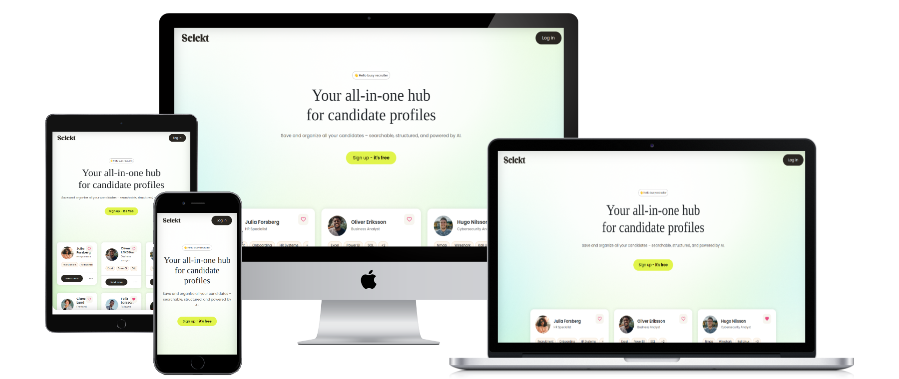
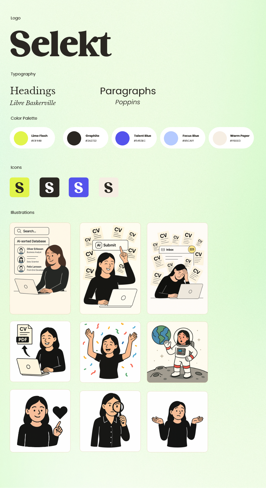
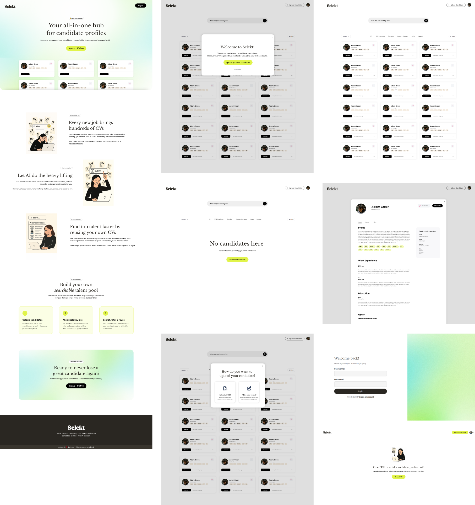

Welcome to **Selekt** 🎉

Selekt is an AI-powered web application designed to **help recruiters manage candidates** in a faster, smarter, and more structured way. Upload a CV, and Selekt instantly summarizes the profile, extracts key skills, and organizes everything into a clean, searchable format – no formatting or manual input needed.

The idea for Selekt came from my years working as a web administrator for companies in the recruitment industry. I saw how much valuable candidate information gets lost in inboxes, folders, and outdated spreadsheets. With Selekt, I wanted to build a tool that not only streamlines day-to-day recruitment tasks but also gives recruiters long-term value by helping them build their own candidate pool.

Selekt acts as your personal, always-accessible candidate database – a single place where you can store everything you know about your candidates: CVs, interview notes, test results, links, documents, skills, and more. All profiles are searchable and structured, making it easy to rediscover great candidates for future roles.

This project was created as part of my Full-Stack Software Development diploma at Code Institute and allowed me to bring together my passion for recruitment, psychology, and tech – and turn it into a real, working solution.

💻 [View the application live here](https://selekt-3ceec5fdccb6.herokuapp.com/)

# Table of Contents

1. [User Experience (UX)](#user-experience-ux)
    - [Goals](#goals)
    - [User Stories](#user-stories)
    - [Wireframes](#wireframes)
    - [Graphic Design & Color Scheme](#graphic-design--color-scheme)
    - [UI/UX Design](#uiux-design)
2. [Agile Methodology](#agile-methodology)
3. [Project Overview](#project-overview)
    - [Introduction](#introduction)
    - [Workflows](#workflows)
    - [Database Overview](#database-overview)
    - [Project Goals](#project-goals)
    - [Project Structure](#project-structure)
4. [Features](#features)
    - [Page Elements](#page-elements)
    - [Key Features](#key-features)
    - [Additional Features](#additional-features)
    - [Feature Changes](#feature-changes)
    - [Future Features](#future-features)
5. [Tools and Technologies](#tools-and-technologies)
    - [Languages](#languages)
    - [Libraries](#libraries)
    - [Development Tools](#development-tools)
    - [Other Tools](#other-tools)
6. [Testing](#testing)
    - [Code Validation](#code-validation)
    - [Browser Compatibility](#browser-compatibility)
    - [Responsiveness](#responsiveness)
    - [User Story Testing](#user-story-testing)
    - [Manual Feature Testing](#manual-feature-testing)
    - [Known Bugs](#known-bugs)
    - [Unfixed Bugs](#unfixed-bugs)
7. [Deployment](#deployment)
    - [Local Deployment](#local-deployment)
    - [GitHub Repository](#github-repository)
    - [Heroku Deployment](#heroku-deployment)
8. [Credits](#credits)
    - [Content & Media](#content--media)
    - [Other Credits](#other-credits)
    - [Acknowledgements](#acknowledgements)


---

## User Experience (UX)

This section outlines the user-centered design approach behind Selekt. The project was planned with both recruiter needs and technical feasibility in mind – ensuring a smooth, intuitive experience backed by powerful functionality.

### Target Group

Selekt is built for recruiters who are short on time and often manage multiple roles simultaneously. These users are typically:

- Working in fast-paced environments with high candidate volume
- Using desktop computers as their primary tool (Selekt should be designed desktop-first)
- Needing instant access to structured information without distractions
- Looking for automation, clarity, and speed in their daily workflow

Selekt prioritizes simplicity, responsiveness, and automation – it’s designed to save time, reduce admin tasks, and help recruiters make better decisions, faster.

---

### Goals

**External users (recruiters) want to:**

- Quickly upload and summarize candidate CVs
- Store all candidate information in one place (CVs, notes, test results, links, images)
- Search and filter candidates based on skills, roles, or custom tags
- Assess candidates and related files efficiently
- Reuse previously evaluated candidates in future recruitment


**The site owner (admin/developer) wants to:**

- Provide a streamlined, user-friendly tool for recruiters
- Store data securely and enable user-based authentication
- Ensure the system is scalable and easy to maintain
- Gain experience with Django, PostgreSQL, and AI APIs in a real-world project

---

### User Stories

User stories were defined using the MoSCoW prioritization method to ensure a focused and value-driven development.  
They are grouped below by priority level and mapped to project epics to support traceability and agile planning.


#### 🔴 Must-Have – Core functionality needed for a usable MVP

These features are critical to delivering the main user value and are linked to key epics such as **User Authentication**, **Candidate Management**, and **AI Upload & Parsing**.

- **Authentication:** Users must be able to sign up, log in, and log out securely.
- **Candidate CRUD:** Recruiters must be able to add, view, edit, and delete candidate profiles.
- **AI CV Parsing:** CVs must be uploaded and parsed into structured summaries using AI.
- **Data Storage:** Extracted data (skills, summary, etc.) must be saved to the database.
- **Search & Sort:** Recruiters must be able to search and sort candidates effectively.
- **Private Access:** Each user must only see their own candidate data.
- **Account Control:** Users must be able to manage and delete their account if needed.
- **UI Framework:** A clean and styled user interface must support all key workflows.


#### 🟡 Should-Have – Important features to improve usability and experience

These features enhance the overall user journey and support better interaction and security. They are included if time permits and are linked to **Interface**, **User Roles**, and **Performance Feedback**.

- Support uploading additional files and notes during candidate creation.
- Allow adding tags or categories to candidates for easier filtering.
- Enable users to mark candidates as favorites for quick reference.
- Paginate long candidate lists and display loading/progress indicators.
- Preview extracted candidate data before saving it.
- Protect URLs and views based on user login status.


#### 🟢 Could-Have – Optional enhancements to boost value

These are nice-to-have features that provide additional polish and flexibility. Linked to **AI Tools** and **Candidate Comparison** epics.

- Generate ready-to-send email templates for each candidate.
- Compare candidates side by side based on selected criteria.
- Show welcome messages or helpful empty states for better UX.
- Add advanced filtering, search combinations, or bulk actions.

---

### Wireframes

To ensure a structured and user-friendly interface, low-fidelity wireframes were created using **Adobe XD** during the early design phase of the project. These wireframes helped visualize key page layouts, user flows, and core interactions before any code was written.

As the platform is primarily intended for use by **recruiters working on desktop computers**, a **desktop-first approach** was adopted throughout the design process. While the application remains responsive and accessible across devices, mobile optimization was not prioritized at this stage.

The wireframes served as a design blueprint and were iteratively refined as new functionality was added during development.

WIREFRAMES HERE

---

### Graphic Design & Color Scheme

The graphic design of Selekt is crafted to communicate clarity, structure, and a sense of trust — all essential traits for a digital product aimed at busy recruiters and HR professionals. Since Selekt is designed as a **desktop-first** web application, the visual identity is tailored to larger screens and professional use cases, where users need to process and compare information efficiently.

#### Colors

The color palette combines vibrant accents with neutral foundations to create a modern, clean, and professional feel. The overall look aims to be easy on the eyes, while supporting intuitive scanning and usability in high-focus work environments.

- **Primary Colors:** Talent Blue `#5453EC`, Lime Flash `#E1F44B`, and Focus Blue `#B5CAFF` serve as attention-grabbing UI accents. These colors were chosen to energize the interface while giving a unique and recognizable brand identity. Blue represents reliability and digital innovation; yellow conveys energy and potential; and light blue adds a sense of clarity and calm.

- **Base Colors:** Black `#2C2B2A` and off-white `#F3ECE6` are used as grounding tones to balance out the bright accents. This ensures strong readability and gives the interface a confident, editorial feel.

Together, these colors give Selekt a confident yet friendly tone — serious enough for recruitment professionals, but dynamic enough to reflect the forward-thinking nature of AI-powered tools.

#### Fonts

- **Libre Baskerville** is used for headings. It’s a serif font that adds a professional and refined tone, making headings stand out and signaling structure.
- **Poppins** is used for paragraph text. It’s a geometric sans-serif font optimized for screen readability, especially helpful when reading structured content like candidate profiles or tool instructions.

This combination of serif and sans-serif fonts supports **both hierarchy and usability**, giving the interface a polished and user-focused aesthetic.

#### UI Visuals

The interface uses clean layouts, rounded buttons, and spacious margins to create a calm and approachable environment. Hover states, shadows, and iconography are used sparingly and with intent — keeping attention on the data, not the decorations.

The visual language of Selekt is enriched by a series of custom illustrations that represent the core actions, emotions, and situations recruiters face in their daily work. These illustrations help humanize the interface and guide users through the application in a light-hearted and approachable way — without compromising the professional tone.

A single character — the recruiter persona — appears across all visuals, creating consistency and personality throughout the platform. The character is shown in different contexts: using the tool, celebrating, exploring, and making decisions.

The illustrations were created with ChatGPT and with a soft color palette and rounded shapes to match the UI’s calm and friendly tone. Each image supports a specific scenario or state in the application.




### UI/UX Design

The user interface and overall user experience of Selekt were designed with a clear goal in mind: to create a fast, intuitive, and stress-free tool for busy recruiters. With limited time and a high volume of candidate data, recruiters need a system that feels effortless to navigate and easy to trust.  

Selekt was developed with a **desktop-first mindset**, as the tool is intended to be used primarily in professional settings where large screens and structured layouts are the norm.

#### ✏️ Design Approach

The initial focus was on creating UI mockups for the most essential user flows:
- The **landing page** (public marketing page)
- The **login/signup view**
- The **dashboard** with candidate cards and filters
- The **candidate profile view**
- The **edit candidate form**
- Various **popups** (e.g. onboarding, upload options)
- The **PDF upload screen**

These views were created in **Adobe XD**. During development, the product evolved beyond the original design scope, and several additional screens were added or refined based on feedback and functionality needs. The visual design followed the same principles throughout to ensure consistency and clarity.



### 💡 UX Considerations

- **Clean, distraction-free layout:** Users should always understand where they are, what they can do, and what’s next.
- **Minimal color usage:** Bright accent colors are used sparingly for clarity, drawing focus to key actions like uploading or saving.
- **Hierarchy through typography:** Headings (Libre Baskerville) create structure, while body text (Poppins) ensures readability.
- **Illustrations and feedback:** Custom visuals help guide the user through actions, errors, and empty states.
- **Accessibility and responsiveness:** While optimized for desktop, key elements such as color contrast, tab order, and alt-text have been considered for inclusive use.

### 🌀 Iterative Changes

Throughout development, several design decisions were adjusted:
- The layout of the candidate cards was optimized for readability when working with large datasets.
- The **edit candidate** form was simplified and grouped for better overview.
- The **upload flow** was split into two clear options: AI-based PDF parsing or manual entry.

All changes were guided by the core principle: **fast access to relevant candidate information, with minimal effort**.

---

## Agile Methodology

This project is developed using an **Agile-inspired workflow** with GitHub Projects. [See Selekt Github Projekt here.](https://github.com/users/fridalannerstrom/projects/2)

All functionality is broken down into **user stories**, written from the user's perspective in the format:

> *As a user, I want to... so that...*

Each user story includes:
- **Type:** User Story or Epic Story
- **Priority:** Assigned using the [MoSCoW method](https://en.wikipedia.org/wiki/MoSCoW_method) (Must Have, Should Have, Could Have, Won’t Have)
- **Acceptance Criteria:** Clear conditions to define when a story is complete

I use **GitHub Projects (Kanban board view)** to visually organize and track my work:
- `Backlog`: All user stories and epics are added here initially
- `Ready`: Tasks that are prioritized and ready to begin
- `In Progress`: Tasks currently being worked on
- `In Review`: Stories ready for testing or feedback
- `Done`: Completed work

### Labels
Each issue is tagged with:
- **Type** (e.g., `user story`, `epic story`)
- **Priority** (e.g., `must-have`, `should-have`)

### Epic Stories
Larger themes are grouped into *epic stories*. Each epic includes links to related user stories and acts as a checklist of progress.  
Example epics: `User Authentication`, `Candidate Management`, `File Uploads`.

### Iterative Development

The scope of the project evolved over time. For example:
- The original design included only a basic dashboard and candidate profile view.
- During development, new features like a **welcome modal**, **PDF upload flow**, and **favorites system** were added as a result of testing and feedback.
- Several wireframes were revised or expanded to match new user needs.

This reflects an agile mindset — allowing the plan to adapt while keeping the user’s goals in focus.

### Example User Story

> **Story:** As a recruiter, I want to upload a CV so that I can automatically generate a structured candidate profile.

**Acceptance Criteria:**
- The recruiter can select a PDF file
- The file is parsed by the AI and displays extracted data
- The extracted data can be previewed and edited before saving

---

## Project Overview

This section provides a high-level overview of the Selekt application: its purpose, workflows, technical architecture, and structure. Selekt is built using Django and follows an MVC (Model-View-Template) pattern to ensure a scalable and maintainable codebase.

---

### 🔍 Introduction

**Selekt** is a web-based platform designed for recruiters and hiring professionals to streamline candidate management. The goal is to reduce time spent on repetitive admin tasks by using AI to extract and structure CV data, and to make it easier to search, compare, and reuse candidate profiles in future recruitment processes.

The target user is:
- A **recruiter or HR manager** working primarily on a **desktop**
- Often under time pressure
- In need of a simple and intuitive system that works “out of the box”

---

### Workflows

Users interact with the system in the following key flows:

| Step | Action                                  | Purpose |
|------|-----------------------------------------|---------|
| 1    | Register or log in                      | Secure access to candidate data |
| 2    | Upload CV or enter candidate manually   | Create new structured profiles |
| 3    | Browse candidates via dashboard         | View, sort, and filter candidates |
| 4    | View full candidate profile             | See skills, experience, notes, and files |
| 5    | Add notes or upload documents           | Enrich candidate profile |
| 6    | Favorite candidates                     | Shortlist the database |

📷 **BILD: Flowchart or user journey map here**

---

### Database Overview

The core data models in Selekt are designed to represent candidates and their related content in a structured, reusable, and recruiter-friendly way.

| Model           | Description                                                        | Key Relationships |
|------------------|--------------------------------------------------------------------|-------------------|
| `Candidate`      | Main candidate profile with personal info, experience, skills, etc. | `ForeignKey` to `User` |
| `CandidateFile`  | Stores uploaded files such as CVs or test results                  | `ForeignKey` to `Candidate` |
| `Favorite`       | Links a user to a candidate they’ve bookmarked                     | `ForeignKey` to both `User` and `Candidate` (unique together) |
| `Profile`        | Extended user profile, includes profile image and first-login flag | `OneToOneField` to `User` |
| `User`           | Django's built-in user model used for authentication               | Owns related `Candidate`, `Favorite`, and `Profile` objects |

📷 **BILD: ERD (Entity Relationship Diagram)**

---

### Project Goals

| Goal | Description |
|------|-------------|
| Simplify candidate management | Avoid cluttered spreadsheets or disorganized documents |
| Leverage AI to reduce manual tasks | Use OpenAI to extract structured candidate data from uploaded PDFs |
| Speed up recruitment | Use OpenAI to extract skills and experience from CVs instantly |
| Improve reusability | Allow recruiters to save and search through their own talent pool |
| Provide structure | Offer a standardized way to view, edit, and compare candidates |
| Keep it minimal | Focus on core needs — no distractions, no bloated features |

---

### Project Structure

The Selekt project is built using Django and follows the **Model-View-Template** (MVT) architectural pattern. It is organized into clearly separated folders for candidates-related logic, global project configuration, templates, static files, and media storage. The structure supports modular development, clean routing, and easy feature expansion.

Below is an overview of the core folders and their responsibilities:

| Folder/File               | Description |
|---------------------------|-------------|
| `candidates/`             | The main Django app containing all candidate logic, models, forms, views, and URLs |
| ├── `models.py`           | Data models: `Candidate`, `CandidateFile`, `Favorite`, `Profile` |
| ├── `views.py`            | All class-based and function-based views including CRUD, AI upload, dashboard, modals |
| ├── `urls.py`             | URL routes for candidate-related features |
| ├── `forms.py`            | Form classes for adding/editing candidates |
| ├── `context_processors.py` | Adds profile picture globally to templates |
| `cleoproject/`            | Root project folder containing settings and global URL config |
| ├── `settings.py`         | Project settings including cloud storage, OpenAI integration, login redirects |
| ├── `urls.py`             | Top-level URL routes for login, dashboard, and app includes |
| `templates/`              | HTML templates organized by view (e.g. `dashboard`, `candidate-form`, `modals`) |
| `static/`                 | Static assets (CSS, JavaScript, fonts, images) used in the frontend |
| `media/`                  | Cloudinary-based media handling for uploaded files and profile images |
| `.env / env.py`           | Environment variables for local development (e.g. API keys, debug mode) |
| `requirements.txt`        | Python dependencies |
| `Procfile`                | Used for deployment to Heroku |
| `manage.py`               | Django’s command-line utility |

This setup makes the application **modular**, **extensible**, and easy to maintain or scale in the future. The structure follows Django conventions and has been kept clean and consistent throughout development.

### 🤖 AI Integration

The application uses the **OpenAI GPT-4o API** to automatically extract structured candidate information from uploaded CVs in PDF format.  
This feature enhances productivity by transforming unstructured data into prefilled candidate profiles.

The logic is implemented directly in Django views and includes:
- PDF text extraction (via PyMuPDF)
- Prompt engineering and response handling
- JSON prefill into the candidate form via session

---

## Features

This section outlines all core and additional features included in Selekt, along with changes made during development and planned improvements. The application has been built with a focus on usability, speed, and structured candidate management.

---

### 📄 Page Elements

| Page | Description | Screenshot |
|------|-------------|------------|
| **Login / Signup** | Clean, distraction-free forms with validation. Login redirects to dashboard. | SCREENSHOT |
| **Dashboard** | Displays candidate cards, filtering, sorting, and favorites toggle. | SCREENSHOT |
| **Candidate Modal** | Full detail view with tabs for notes and uploaded files. | SCREENSHOT |
| **Candidate Form** | Rich form with multiple fields, file upload, and profile image support. | SCREENSHOT |
| **Upload PDF** | AI-powered upload page that extracts and pre-fills candidate data. | SCREENSHOT |
| **Upload Options Modal** | Choose between AI-based upload or manual form entry. | SCREENSHOT |
| **Settings Page** | Allows users to update personal info, profile image, password, and delete account | SCREENSHOT |
| **404 Page** | Branded error page with illustration and friendly message for lost users | SCREENSHOT |

---

### ⭐ Key Features

| Feature | Description | Screenshot |
|--------|-------------|------------|
| **User Authentication** | Secure login, logout, and signup with Django’s built-in user model. | SCREENSHOT |
| **Dashboard Overview** | Sort and filter candidates by job title, search term, or favorites. | SCREENSHOT |
| **CRUD for Candidates** | Create, update, view, and delete candidates with form validation. | SCREENSHOT |
| **Candidate Modal** | Open dynamic modal for faster interactions without leaving dashboard. | SCREENSHOT |
| **Favorite Candidates** | Bookmark candidates for quick access. Stored per user. | SCREENSHOT |
| **Cloud-based File Upload** | Upload multiple CVs and files per candidate using Cloudinary. | SCREENSHOT |
| **OpenAI Integration** | Parse PDFs and extract structured data (name, skills, summary, etc.) | SCREENSHOT |
| **Prefilled Forms** | Candidate form is automatically pre-populated after AI parsing. | SCREENSHOT |

---

### ✨ Additional Features

| Feature | Benefit | Screenshot |
|--------|---------|------------|
| **Welcome Popup** | Guides first-time users through uploading their first candidate. | Screenshot |
| **Smart Tabs (Top Titles)** | The dashboard automatically displays tabs for your four most common job titles. | Screenshot |
| **Favorite Filtering** | Show only bookmarked candidates, even when search or tabs are used. | Screenshot |
| **Sort by Name or Date** | Toggle between alphabetical or date-based ordering on the dashboard. | Screenshot |
| **Basic Search** | Search candidates using keywords (e.g. name, title, skills). Could be improved in future versions. | Screenshot |
| **Add Candidates Manually** | Users can choose to fill in all candidate information themselves. | Screenshot |
| **AI-based Profile Summary** | The "Profile" section is automatically generated by OpenAI from the uploaded CV. | Screenshot |
| **Skills Extraction + Manual Input** | Top skills are extracted by AI from the CV, and users can also manually enter or edit them (comma-separated). | Screenshot |
| **Profile Pictures** | Each candidate can have a profile image uploaded via Cloudinary. | Screenshot |
| **Add Multiple Links** | Dynamically add as many custom links as you like (e.g., GitHub, LinkedIn) in a flexible input loop. | Screenshot |
| **Notes Tab per Candidate** | Add personal notes to each candidate in a dedicated tab. | Screenshot |
| **File Upload** | Upload and manage files like CVs and test results under each candidate. | Screenshot |
| **Delete Confirmation Popup** | Deleting candidates or files prompts a confirmation modal to prevent mistakes. | Screenshot |
| **Custom 404 Page** | A branded “lost in space” illustration provides a helpful and friendly fallback if the user hits a broken link. | Screenshot |
| **Bulk Upload** | Allow multiple files to be uploaded at one in candidate modal | SCREENSHOT | Screenshot |
| **Empty States with CTA** | If no candidates exist, users see a custom illustration and clear call-to-action button to upload their first candidate. | Screenshot |

#### Notes on Search Functionality

The dashboard includes a basic search bar where users can search candidates by name, title, location, or top skills. While functional, the search currently uses simple substring matching. A more advanced implementation using AI logic with fuzzy search or weighted fields could improve result accuracy in future iterations.

---

### Future Features

| Planned Feature | Description |
|-----------------|-------------|
| **Bulk Upload** | Allow multiple PDFs to be parsed at once | SCREENSHOT |
| **AI Interview Notes Summarizer** | Upload notes and get a clean summary | SCREENSHOT |
| **Candidate Comparison Tool** | Compare two candidates side-by-side | SCREENSHOT |
| **Tags & Smart Filters** | Add custom tags and more flexible filtering | SCREENSHOT |


---

## Tools and Technologies

Selekt was developed using a modern full-stack toolchain, combining proven backend technologies with flexible frontend libraries and cloud-based services.

---

### Languages

| Language  | Usage |
|-----------|-------|
| **Python** | Core backend logic using Django framework |
| **HTML5**  | Templates for user interface and structure |
| **CSS3**   | Styling, responsive layout, and custom branding |
| **JavaScript** | Frontend interactivity (modals, dynamic forms, tag inputs) |

---

### Frameworks & Libraries

| Tool | Purpose |
|------|---------|
| **Django** | Main web framework (MVT pattern, authentication, ORM) |
| **Bootstrap (via CDN)** | Responsive layout and component structure |
| **Trumbowyg** | WYSIWYG editor for candidate profile fields |
| **Tagify** | Skill tag input system for comma-separated fields |
| **Cloudinary + Cloudinary Storage** | File/image upload handling for candidate profile pictures and CVs |
| **OpenAI (gpt-4)** | AI integration for CV parsing and profile generation |

---

### Development Tools

| Tool | Role |
|------|------|
| **Git & GitHub** | Version control, branching, issues, and epics |
| **GitHub Projects** | Agile board for user stories and MoSCoW prioritization |
| **Visual Studio Code (VS Code)** | Local development, debugging, and extension support |
| **SQLite** | Default development database for local testing |
| **PostgreSQL (Heroku-ready)** | Cloud-compatible database for deployment scenarios |

---

### Other Tools & Resources

| Tool | Description |
|------|-------------|
| **Heroku** | Cloud platform for deployment and production hosting |
| **Whitenoise** | Static file management for production |
| **dj-database-url** | Simplifies cloud DB configuration in `settings.py` |
| **dotenv / env.py** | For environment variable handling across local and prod |
| **Draw.io / Canva / Adobe XD** | Used for wireframing, UI design, and ERD sketches |
| **Markdown** | Used extensively for documenting user stories, README and planning |

---

## Testing

This project includes both **automated** and **manual testing** to ensure robust functionality, user safety, and a seamless experience across devices and browsers. All key flows such as authentication, CRUD operations, AI processing, and session handling have been tested. 

---

### Automated Testing

Automated tests were implemented using Django's `TestCase` framework and run via:

```bash
python manage.py test
```

#### 🔍 Test Overview

| Test Name | Description |
|-----------|-------------|
| `test_dashboard_loads` | Authenticated users can access the dashboard |
| `test_dashboard_requires_login` | Anonymous users are redirected to login |
| `test_create_candidate` | A candidate can be created via the form |
| `test_update_candidate` | Candidate data can be updated |
| `test_delete_candidate` | Candidates can be removed |
| `test_user_cannot_access_others_candidate` | Protects data privacy between users |
| `test_toggle_favorite` | AJAX request toggles favorite and returns correct JSON |
| `test_call_openai_returns_expected_data` | Mocks OpenAI, validates structure |
| `test_candidate_create_form_prefills_from_session` | Session prefill is correctly parsed into form fields |
| `test_welcome_modal_shown_only_once` | Welcome modal appears only once on first login |

✅ **All tests pass successfully**

---

#### Code Coverage

Measured using `coverage.py`:

```bash
coverage run manage.py test
coverage report
coverage html
```

##### Summary

| File | Coverage |
|------|----------|
| `candidates/tests.py` | 100% |
| `views.py` | 57% – All critical views tested |
| `models.py` | 76% – Core logic and methods |
| Other files (forms/context processors) | Partial |
| Boilerplate/migrations | Excluded |

> 💡 Total project coverage: **74%**  
> ✔️ Strong for a full-stack MVP with AI integration

---

### Manual Testing

In addition to automated testing, this project was thoroughly manually tested to ensure robustness, proper validation, and user experience across different usage scenarios. Each test includes a description of the area, the expected result, the actual result, and optionally a screenshot for visual proof.

---

#### Manual Test Table

| Test Area | Expected Result | Actual Result | Screenshot |
|-----------|------------------|----------------|------------|
| Empty form submission | Validation errors shown, no data saved | ✅ Errors displayed correctly |  |
| Invalid email input | Email validation error shown | ✅ Error shown |  |
| Nonexistent candidate access | 404 error returned | ✅ 404 page shown |  |
| OpenAI failure handling | Error shown to user with CTA | ✅ Error message and button shown |  |
| Rapid favorite toggling | No crash, favorite toggled correctly | ✅ Works as expected |  |
| Welcome modal close | Closes and doesn't reappear after reload | ✅ Modal dismissed permanently |  |
| Unauthorized access | Redirect to login | ✅ Redirected as expected |  |
| Mobile view of dashboard | UI is responsive and buttons work | ✅ Responsive and readable |  |
| Candidate with no data | Page loads, blank fields handled | ✅ Empty sections render cleanly |  |
| Invalid file upload | Error message shown for unsupported file types | ✅ Error displayed, upload blocked |  |
| Session timeout | After logout, accessing protected routes redirects to login | ✅ Redirect to login page shown |  |
| Special characters in candidate | Text with symbols (e.g. é, ö, @) saved and displayed correctly | ✅ Characters saved and rendered correctly |  |

---

#### Technologies Used for Testing

- Python 3.11
- Django TestCase (unit and view tests)
- unittest.mock (mocking external APIs like OpenAI)
- coverage.py (code coverage reports)
- Bootstrap modals and JavaScript for frontend behavior simulation

---

#### Future Improvements

The following features were considered "Could Have" and may be added in future iterations:

| Feature | Description |
|--------|-------------|
| Improved formatting of OpenAI responses | Using Markdown or structured HTML tags to enhance readability of generated candidate summaries. |
| Sticky candidate sidebar | Keeping key candidate information visible while scrolling the dashboard. |
| More extensive validation | Such as handling empty form submissions or displaying custom messages for missing candidate data. |
| Upload loading indicator | Add a visual loading animation or progress indicator when uploading files to improve feedback and avoid user confusion. |

---

## Code Validation

### HTML Validation

All templates were validated via [W3C Validator](https://validator.w3.org/).

| File | Validator Result | Comments |
|------|------------------|----------|
| `base.html` | ✅ Valid | - |
| `dashboard.html` | ✅ Valid | - |
| `candidate-form.html` | ✅ Valid | - |
| `login.html` | ✅ Valid | - |
| `404.html` | ✅ Valid | - |
| `add-candidate.html` | ✅ Valid | - |
| `base-auth.html` | ✅ Valid | - |
| `candidate-form.html` | ✅ Valid | - |
| `file-list.html` | ✅ Valid | - |
| `index.html` | ✅ Valid | - |
| `modals.html` | ✅ Valid | - |
| `settings.html` | ✅ Valid | - |
| `signup.html` | ✅ Valid | - |
| `upload-candidate.html` | ✅ Valid | - |


### CSS Validation

Validated using [W3C CSS Validator](https://jigsaw.w3.org/css-validator/).

| File | Validator Result | Comments |
|------|------------------|----------|
| `style.css` | ✅ Valid | - |


### JavaScript Validation

Tested via [JSLint](https://jshint.com/). ES6 syntax was enabled via `/* jslint esversion: 6 */`.  
All remaining warnings were reviewed and documented below. No functional issues were found.

| File | Validator Result | Comments |
|------|------------------|----------|
| `main.js` | ✅ Valid | initUploadScript is defined in another file and used globally; warning can be ignored. |
| `editor.js` | ✅ Valid | $ is provided by jQuery; showAddLinkForm, addLinkRow, and removeLink are used in HTML or reserved for flexibility. |
| `fileUpload.js` | ✅ Valid | openDeleteFileModal is defined elsewhere; initUploadScript and reloadFiles are reserved for future use. |
| `modals.js` | ✅ Valid | bootstrap and global functions are defined externally; modal functions are triggered via HTML. |
| `favorites.js` | ✅ Valid | toggleFavorite is used in HTML; warning can be ignored. "?" line break warning is stylistic only. |
| `sorting.js` | ✅ Valid | Line 16 warning is stylistic; code works as intended. |
| `uploadCandidate.js` | ✅ Valid | Line break before "?" is stylistic and does not affect execution; code runs as intended. |
| `utils.js` | ✅ Valid | updateHiddenLinks is defined in another file and used globally; warning can be ignored. |
| `welcomeModal.js` | ✅ Valid | Optional chaining requires ES11; works in all modern browsers. bootstrap is defined via CDN. |


### Python Code Validation (flake8)

All Python files were validated using `flake8` in VS Code.  
No critical issues were found. 

| File | flake8 Result | Comments |
|------|---------------|----------|
| `views.py` | ✅ Valid | - |
| `models.py` | ✅ Valid | - |
| `forms.py` | ✅ Valid | - |
| `urls.py` | ✅ Valid | (app file) |
| `urls.py` | ✅ Valid | (project file) |
| `tests.py` | ✅ Valid | - |
| `admin.py` | ✅ Valid | - |

**Notes**

Some lines in `settings.py` and `env.py` exceed the standard PEP8 line length (79–119 characters) particularly for API keys.

These have been kept as single lines intentionally for clarity and to follow Django and third-party library documentation more closely. 

This deviation is considered acceptable in a production context and does **not** affect performance, security, or maintainability.

---


## 🐞 Bug Fixes

This section outlines key bugs discovered during development and testing, along with how they were resolved. These fixes improved form functionality, file handling, frontend behavior, and data persistence.

---

### 1. Profile Image Not Saving When Adding Candidate

**Issue:**  
Uploaded profile images were not saved correctly when creating a new candidate. The form silently failed due to missing file encoding setup.

**Cause:**  
The form lacked the required `enctype="multipart/form-data"` attribute, preventing proper file transmission.

**Fix:**  
The `<form>` tag was updated to include `enctype="multipart/form-data"`:

```html
<form method="post" enctype="multipart/form-data">
    
    ...
</form>
```

✅ After the fix, both text and image data were saved as expected to `/media/profile_images/`.

---

### 2. Links Not Saving When Adding a Candidate

**Issue:**  
While editing a candidate allowed saving links correctly, creating a new candidate did not.

**Cause:**  
Links were not added to `form.instance` before saving in the `CandidateCreateView`.

**Fix:**  
Combined link data (`name:::url;;;`) is now injected into `form.instance.links` before saving. Example:

```python
link_names = self.request.POST.getlist('link_names')
link_urls = self.request.POST.getlist('link_urls')
combined_links = ''
for name, url in zip(link_names, link_urls):
    if name and url:
        combined_links += f'{name}:::{url};;;'
form.instance.links = combined_links
```

| Action | When Links Are Saved |
|--------|----------------------|
| Add    | Before `form_valid()` |
| Edit   | After `form_valid()`  |

---

### 3. WYSIWYG Editor Not Loading

**Issue:**  
The Trumbowyg WYSIWYG editor stopped working. Toolbar was missing and error `Uncaught ReferenceError: $ is not defined` appeared.

**Cause:**  
jQuery was not fully loaded before the editor script was executed.

**Fix:**
- Ensured all jQuery-based logic is placed inside `$(document).ready(...)`
- Adjusted script load order: jQuery → Trumbowyg → Bootstrap → Custom scripts

✅ The editor now loads properly and supports formatting on both create and edit forms.

---

### 4. JavaScript Error When Adding New Links

**Issue:**  
Dynamically adding links caused JS errors:  
`linksArray is not defined`, `jsonInput is not defined`.

**Cause:**  
The JavaScript function `updateHiddenLinks()` referenced undefined variables and assumed missing DOM nodes.

**Fix:**
- Declared all expected variables at the top of the script.
- Added `null` checks before accessing DOM.
- Included missing hidden fields in the HTML:

```html
<input type="hidden" id="linksField" name="linksField">
<input type="hidden" id="hiddenLinksInput" name="linksJson">
```

✅ Links can now be added and removed dynamically without breaking the form.


### Conditional Script Execution

To prevent JS errors on pages missing upload elements, the `initUploadScript()` function now includes:

```js
if (!document.querySelector("#uploadBox")) {
  console.warn("Upload script not initialized: missing DOM elements.");
  return;
}
```

This ensures modular script behavior across templates.

---


### ⚠️ Known Issues & Limitations

| Issue | Status |
|-------|--------|
| `aria-hidden` warning on modal focus | Non-blocking, ignored |
| Back to candidates after editing | Returns to dashboard, not modal – future UX improvement |
| Basic search logic | Works but lacks fuzzy logic or relevancy weighting |
| Page titles | Static `<title>` tags – should be dynamic for SEO |

---

## Deployment

This section describes how the Selekt application was deployed for both local development and live production using Heroku.

---

### Local Deployment

To run the project locally:

1. **Clone the repository:**

```bash
git clone https://github.com/fridalannerstrom/selekt.git
cd selekt
```

2. **Create a virtual environment:**

```bash
python -m venv venv
source venv/bin/activate  # macOS/Linux
venv\Scripts\activate     # Windows
```

3. **Install dependencies:**

```bash
pip install -r requirements.txt
```

4. **Create `.env` or `env.py` file** and add your environment variables:

```env
SECRET_KEY=your_secret_key
DEBUG=True
CLOUDINARY_CLOUD_NAME=...
CLOUDINARY_API_KEY=...
CLOUDINARY_API_SECRET=...
OPENAI_API_KEY=...
```

5. **Run migrations:**

```bash
python manage.py migrate
```

6. **Start the server:**

```bash
python manage.py runserver
```

Then visit `http://localhost:8000` to use the application locally.

---

### GitHub Repository

The project is version controlled using **Git** and hosted on **GitHub**:

🔗 [GitHub Repo – selekt](https://github.com/fridalannerstrom/selekt)

Best practices followed:
- Commits are small and descriptive
- Feature branches used for development
- GitHub Projects used to track epics, user stories, and bugs
- `.env` and `.sqlite3` files excluded via `.gitignore`

### Heroku Deployment

The live version is hosted on **Heroku**, using PostgreSQL and Cloudinary for file storage.

**Steps followed:**

1. **Create Heroku app:**
```bash
heroku create selekt-app-name
```

2. **Add Heroku PostgreSQL add-on:**
```bash
heroku addons:create heroku-postgresql:hobby-dev
```

3. **Set environment variables in Heroku Dashboard:**
- `SECRET_KEY`
- `DEBUG = False`
- `CLOUDINARY_*`
- `OPENAI_API_KEY`

4. **Update settings.py:**
- Used `dj_database_url` to connect to PostgreSQL
- Added `whitenoise` for static file handling
- Set `STATIC_ROOT` and `MEDIA_ROOT`

5. **Configure Cloudinary:**
- Cloud-based storage for profile images and uploaded files
- Used `cloudinary_storage` for both `DEFAULT_FILE_STORAGE` and `STATICFILES_STORAGE`

6. **Push code to Heroku:**
```bash
git push heroku main
```

7. **Run migrations and create superuser:**
```bash
heroku run python manage.py migrate
heroku run python manage.py createsuperuser
```

8. **Open the live app:**
```bash
heroku open
```

---

### Deployment Notes

- Static files are served via **Whitenoise**
- Media files (CVs, profile images) are stored in **Cloudinary**
- Database is automatically switched between **SQLite (local)** and **PostgreSQL (Heroku)** using `dj_database_url`
- Environment variables are securely managed via `.env` (local) and Heroku Config Vars (production)
- `DEBUG` is turned off in production, and all secrets are hidden from Git

---

## Credits

This section lists tools, resources, and people who contributed directly or indirectly to the creation of Selekt.

---

### Content & Media

| Resource | Usage |
|----------|-------|
| [Unsplash](https://unsplash.com) | Candidate profile images (placeholder content) |
| [Font Awesome](https://fontawesome.com/) | Icons used throughout the UI |
| [Mockup Generator](https://techsini.com/multi-mockup/index.php) | Device mockups for documentation and README |
| [Adobe XD](https://www.adobe.com/products/xd.html) | UI wireframes and design prototypes |
| [CloudConvert](https://cloudconvert.com/) | Converted image formats (e.g., PNG to WebP) |
| [ChatGPT](https://chat.openai.com) | Helped generate placeholder CVs, summaries, UX content, and illustrations for UI/README |

---

### 💡 Other Credits

| Source | Contribution |
|--------|--------------|
| [Code Institute](https://codeinstitute.net/) | Course structure, guidance, and the Full Stack framework |
| [Django](https://www.djangoproject.com/) | Main backend framework and detailed documentation |
| [Bootstrap](https://getbootstrap.com/) | Frontend components and responsive layout system |
| [W3Schools](https://w3schools.com/) | Quick references for HTML, CSS, JavaScript |
| [Conventional Commits](https://www.conventionalcommits.org/) | Helped shape meaningful commit messages and structure version control habits |

---

### 🙌 Acknowledgements

A huge thank you to:

- **My mentor Rory Patrick** – for his support, code reviews, and valuable guidance throughout the project.
- **Code Institute** – for building the foundation and structure that made this full-stack journey possible.
- **The developer community** – Stack Overflow, GitHub discussions, and Discord chats were incredibly helpful during tricky debugging moments.
- **Friends and testers** – who gave early feedback, found UI quirks, and helped test features.

---

## ✍️ Author

This project was created by **Frida Lannerström** as part of Portfolio Project 4 in the Full Stack Developer Diploma at Code Institute.

---


# ✅ Project 4 Distinction Checklist

## 1. Planning & UX/Design
- [ ] Use an Agile tool (e.g., GitHub Projects) to plan the project.
- [ ] Create and document Epics → User Stories → Tasks.
- [ ] Define clear User Acceptance Criteria.
- [ ] Design wireframes, mockups, and document UX work.
- [ ] Follow UX design principles and accessibility guidelines (WCAG).
- [ ] Ensure the website is fully responsive.
- [ ] Organize information according to Information Hierarchy.
- [ ] Create intuitive and user-friendly navigation.

## 2. Frontend
- [ ] Use semantic HTML and clean CSS.
- [ ] Validate HTML/CSS with W3C/Jigsaw validators.
- [ ] Link JavaScript correctly and validate it.
- [ ] Link CSS in `<head>` and JavaScript at the bottom of `<body>`.
- [ ] Avoid aggressive pop-ups or autoplaying media.

## 3. Backend (Python/Django)
- [ ] Follow MVC (Model-View-Template) architecture correctly.
- [ ] Create at least one custom model and document it.
- [ ] Implement full CRUD functionality (Create, Read, Update, Delete).
- [ ] Display immediate feedback on data changes.
- [ ] Implement forms with correct validation.
- [ ] Write robust Python code following PEP8 standards.
- [ ] Ensure secure data handling and clear error messages.

## 4. Authentication and Permissions
- [ ] Implement user registration and login.
- [ ] Use role-based permissions (e.g., admin vs. user).
- [ ] Prevent unauthorized access to protected pages.
- [ ] Display current login state to the user.

## 5. Testing
- [ ] Create Python tests for critical functionality.
- [ ] Create JavaScript tests where relevant.
- [ ] Document all tests in the README.
- [ ] Document found bugs, fixes, and any unfixed bugs.

## 6. Git and Version Control
- [ ] Use Git continuously with small and clear commits.
- [ ] No passwords or secrets included in the code (use `.gitignore`).
- [ ] Write meaningful commit messages.
- [ ] Handle requirements.txt and version branches properly.

## 7. Deployment
- [ ] Deploy the app to a cloud platform (e.g., Render, Heroku).
- [ ] Set `DEBUG = False` in the deployed version.
- [ ] Store secrets securely (environment variables).
- [ ] Provide clear deployment documentation in README.
- [ ] Remove commented-out code and broken links.

## 8. Code Quality
- [ ] Ensure consistent, readable code (indentation, naming conventions).
- [ ] Name all files and folders consistently without spaces or capitals.
- [ ] Include clear comments in all custom code files.
- [ ] Maintain a clean file structure (separate folders for CSS, JS, templates).

## 9. README.md
- [ ] Write README in English, structured with Markdown.
- [ ] Include:
  - Project description and purpose
  - How to clone/run the project
  - Features and User Stories
  - Database model/schema
  - Testing documentation
  - Deployment process
  - Security practices

## 10. Extra for Distinction
- [ ] Ensure the project is original (not a walkthrough copy).
- [ ] Create a professional-grade UI and clean code structure.
- [ ] Provide immediate feedback for all user actions.
- [ ] Demonstrate high-level "craftsmanship" in code.
- [ ] Implement strong security features (API error handling, form validation, 404 pages).
